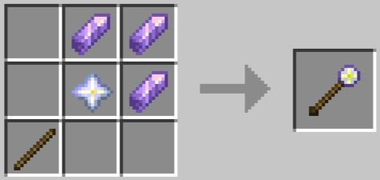
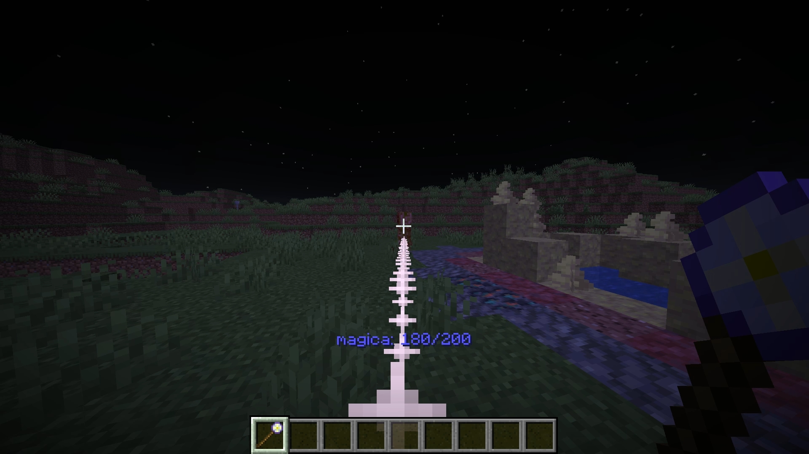
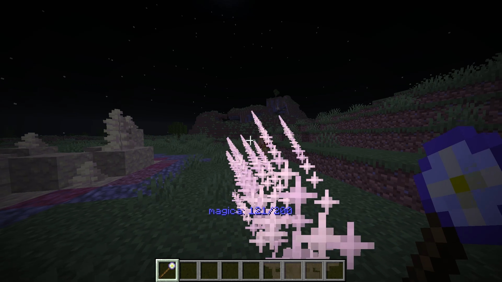
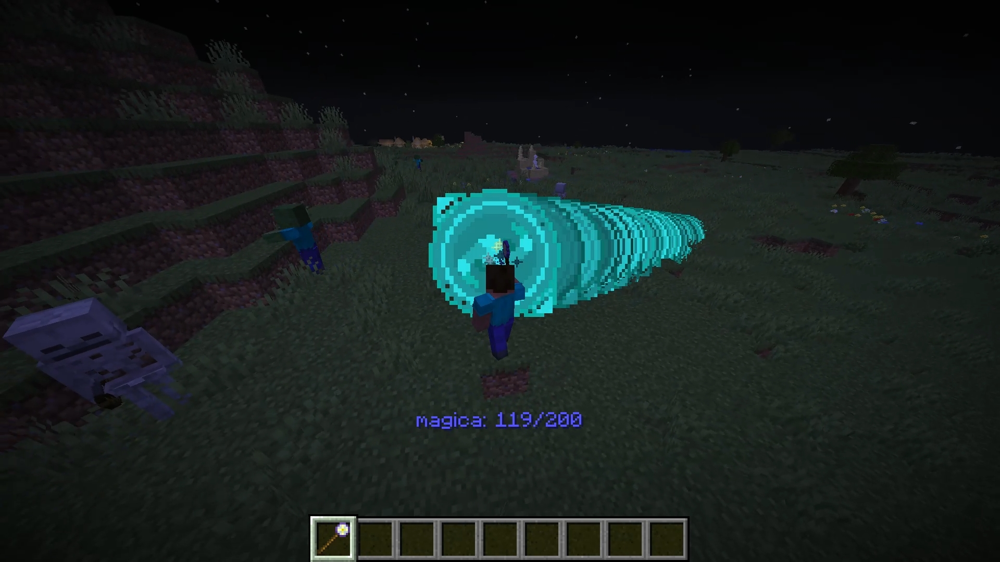
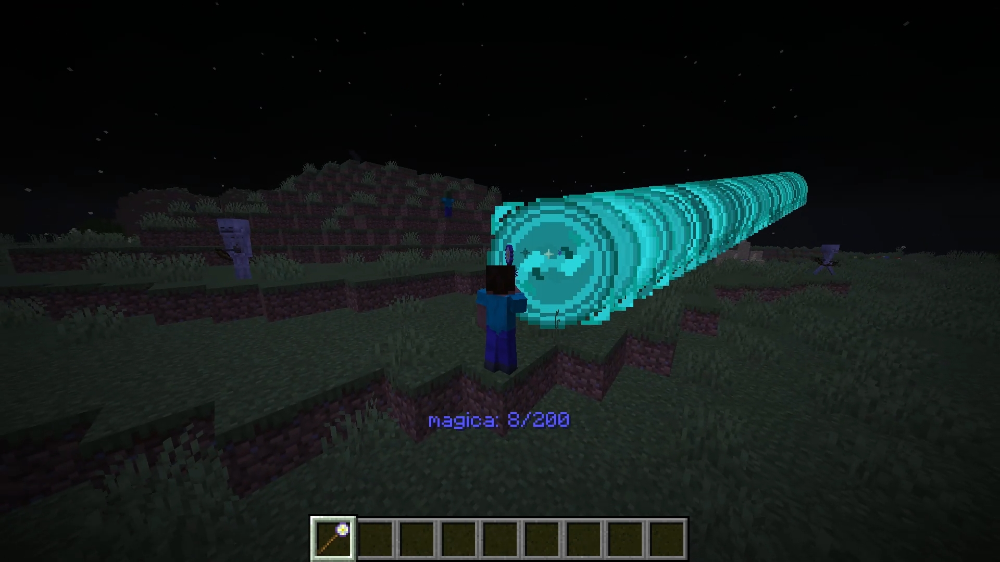

# PureMagicCaster
純粋な魔力を放出する魔法  
ゆるひラボ開催のデータパックコンテスト第一回に提出した作品

## 追加されるアイテム
### Pure Magic Staff

#### 使い方
右クリック長押しから離すと魔法発動。  
長押し時間によって発動する魔法が3段階に変化  
- 1段階目  
低ダメージの魔力の欠片を撃つ。
  
-  2段階目  
1段階目と同じものを前方にばらまく。
  
-  3段階目  
発動地点から魔力を前方に打ち出す。触れ続けると無敵時間を無視してダメージを受ける。
発動中は自身を魔力で覆い、ビームのダメージを受けなくなる。

  

#### Magicaについて
魔法の発動にはアクションバーに表示されている**magica**を使う。  
1段階目では**20**  
2段階目では**50**  
3段階目では発動中**毎tick3** を消費する  
magicaは消費後、一定時間経過するとリチャージが開始される。  
ただし、発動した魔法の段階によってリチャージまでの時間が違う。  

# 導入方法  
ダウンロードしたファイルの中にある  
"**datapack**"フォルダ中の"**PureMagicCaster**"をワールドのデータパック用フォルダへ  
"**resource_pack**"フォルダ中の"**jmp_pmc_resources**"をマイクラのリソースパック用フォルダへ入れて設定から有効化
